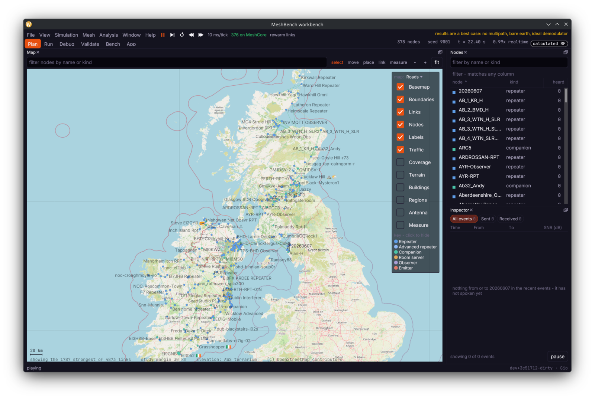

# MeshBench

**Everything you need to work on MeshCore, in one binary.** Plan a network,
develop firmware, and build a companion app — against real MeshCore code running
on a sample-accurate LoRa channel over real terrain.

It runs the published firmware, byte for byte, and the channel does not decide
anything: it sums waveforms, applies path loss and adds noise, and each
receiver's demodulator finds out. So the question it answers is not *would a
packet get through*, but **what arrived at the antenna, and why**.

[](https://github.com/MeshBench/meshbench/actions/workflows/ci.yml)
[](https://github.com/MeshBench/meshbench/releases/latest)
[](LICENSE)
[](go.mod)



## Try it in thirty seconds

Download the build for your platform from the
[latest release](https://github.com/MeshBench/meshbench/releases/latest) and run
it. Nothing else has to be installed first.

```bash
# Linux
chmod +x meshbench-*.AppImage && ./meshbench-*.AppImage
```

It opens on a real network — 161 nodes across Scotland — with terrain
underneath. Press **Play**. Watch adverts propagate, click two nodes to get both
link margins and the terrain cut-through that explains them.

Per-platform detail, including the macOS and Windows signing caveats, is in
**[`docs/install.md`](docs/install.md)**.

## Three things it is for

### Plan a network

Coverage rasterised over real terrain and searched for where the next node
should go. Both link margins for any pair, and the terrain cut-through that
explains them — in both directions, because reachability is asymmetric. Import
a live network from CoreScope, Beacon or MQTT and ask what it would do.

### Develop firmware

Run **MeshCore's own code**, not a reimplementation. Routing, flood suppression,
duty-cycle policing and CSMA timing are the real thing, running against our
radio. Point `meshcoresim dev` at a checkout and the workbench runs your build;
run half a mesh on one firmware and half on another, same traffic, and diff.
Published `.uf2` and `.bin` images boot under QEMU and Renode, and the board
matrix below says which have actually been watched doing what.

### Build a companion app

`meshcoresim serve` runs a mesh and exposes a node to your application over
**TCP, a serial pty, or Bluetooth** — the real companion protocol, spoken by
real firmware. Your app cannot tell it from a radio on a desk, and you can put
forty nodes and a hill between it and the far end without leaving the room.

## Why the physics matters to all three

Most mesh simulators answer *did the packet arrive* from a link-budget rule.
That tells you nothing about the case that actually matters: a marginal link,
two nodes transmitting at once, a hill in the way.

MeshBench does not have that rule. **The channel decides nothing.** It sums
waveforms, applies path loss over real terrain, adds thermal noise, and lets each
receiver's demodulator find out — through the full receive chain: dechirp,
Gray, the diagonal deinterleaver, Hamming FEC, dewhitening, header and payload
CRC. Capture effect, partial collisions and sensitivity are *emergent*, not rules
somebody wrote down.

That is what makes a firmware change or an app's retry logic testable here at
all: the failure you are chasing has to be able to happen.

## What you get

| | |
|---|---|
| **Why a link missed** | Terrain cut-through with the Fresnel zone and each diffracting edge's own loss, in both directions. |
| **What the air looked like** | Waterfall, IQ, and a dechirped symbol view showing which of two colliding frames captured. |
| **Coverage and planning** | Link budgets rasterised over terrain, combined across a fleet, and searched for where the next node should go. |
| **Real boards** | Published `.uf2` and `.bin` images under QEMU and Renode, with a capability matrix that says what has been watched happening. |
| **Firmware A/B** | Half the repeaters on one build, half on another, same traffic, and diff. |
| **Your app against a mesh** | A real companion over TCP, a serial pty, or Bluetooth. |
| **Repeatable tests** | `meshcoresim test` runs a fixture on real firmware and checks its assertions — for CI, yours or MeshCore's. |
| **Wireshark** | Every receiver's view of every frame, live over loopback UDP or saved as pcapng. |
| **SDR** | Export IQ or stream it, so an unmodified SDR client sees the simulated band. |
| **Batteries and solar** | Whether a node survives the winter where you want to put it. |

Every result is **deterministic**: same seed, same scenario, same answer. It is a
native desktop application and a command line — one binary, no service to
deploy, and nothing in the simulation depends on anything we run.

## Honesty about the model

**Treat a MeshBench result as a best case.** The simulator is kinder than the
air: no multipath, no oscillator error, no body loss, bare-earth terrain unless
you load buildings. Nearly every known bias points the same way, which is what
makes the tool usable — *if it says a link will not work, believe it; if it says
a link will work marginally, go and measure.*

That is not buried here. It is stated in the interface, on every result, and
**[`docs/shortcomings.md`](docs/shortcomings.md)** is a long, specific and
maintained account of what the model does not do, what it gets measurably wrong,
and in which direction. It includes the parts that have never been checked
against real air.

## Board compatibility

Which published board images have actually been run here, and how far each one
got. Every row is a measurement, not a claim about the hardware: the firmware is
the released `.uf2` or merged `.bin` from MeshCore's own releases, run under an
emulator, and a blank cell means nobody has watched that board do that thing.

| Board | MCU | Emulator | build | boot | radio | tx | rx | flood | fem | power |
|---|---|---|:-:|:-:|:-:|:-:|:-:|:-:|:-:|:-:|
| `Generic_E22_sx1262` | ESP32 | QEMU | ✓ | ✓ | ✓ | ✓ | ✓ | ✗ | ✓ | ✓ |
| `Heltec_t114` | nRF52840 | Renode | ✓ | ✓ | ✓ | ✓ | ✓ | ✗ | – | ? |
| `Heltec_t096` | nRF52840 | Renode | ✓ | ✓ | ✓ | ✓ | ✓ | ✗ | ? | ? |
| `RAK_4631` | nRF52840 | Renode | ✓ | ✓ | ✓ | ✓ | ✓ | ✗ | – | ? |
| `Xiao_nrf52` | nRF52840 | Renode | ✓ | ✓ | ✓ | ✓ | ✓ | ✗ | – | ? |
| `Heltec_mesh_solar` | nRF52840 | Renode | ✓ | ✓ | ✓ | ✓ | ✓ | ✗ | – | ? |
| `Xiao_S3_WIO` | ESP32-S3 | QEMU | ✓ | ✗ | | | | | | |
| `Heltec_v3` | ESP32-S3 | QEMU | ✓ | ✗ | | | | | | |
| `Station_G2` | ESP32-S3 | — | | | | | | | | |
| `Heltec_v2` | ESP32 | — | | | | | | | | |

✓ passed  ✗ failed  – not applicable  ? not measurable yet  blank not attempted

What the columns mean:

- **build** — a published image for this board exists and its digest checks out.
- **boot** — the emulator attached and the node kept its clock. Weaker than it
  sounds: an emulated part advances its clock whether or not its core is
  executing, so this passed against machines sitting in lockup until that was
  found.
- **radio**, **tx** — the board put something on the air. Watched, not
  commanded: an emulated board's console is not reachable on every backend, and
  what arrives is the firmware's own unprompted advert.
- **rx** — it heard another node.
- **flood** — it *forwarded somebody else's packet*, which is the thing a
  repeater is for. Judged at the board, not at the far end: the probe puts it on
  the only path between two others and requires its own transmission.
- **fem** — the front-end module was switched in to transmit. Only two of these
  boards carry one, and only a backend with a pin for it can tell.
- **power** — it was still answering after being left idle. Asked on the console
  where there is one, and over the air where there is not: a board that relays
  again after an idle has a radio receiving, a mesh stack deciding and a radio
  transmitting.

Where the failures are, and why they are not the board's fault:

- **No board has been observed relaying.** This column showed three ticks
  until the test was corrected: it waited for *any* transmission from the board,
  and MeshCore's repeater adverts on its own timer every two minutes against a
  four-minute window, so a board that forwards nothing passed by being alive.
  The row now requires the board to put *the sender's* message back on the air,
  and every board fails it — including the ESP32 one, on a different emulator,
  with a real console, that passes every other column. Why nothing relays is
  open: every gate in MeshCore's own `allowPacketForward` is permissive on a
  fresh node.
- **Three nRF52 boards stopped executing partway through a run**, which was a
  gap in our platform rather than anything about them: they read an address in
  CryptoCell's public-key accelerator upwards of 120 million times and never
  returned. Renode's nRF52840 maps nothing there, and MeshCore compiles
  hardware crypto in for every nRF52 board, so the firmware waited on an
  accelerator that was not there — reached from Ed25519 signature verification
  on the advert receive path. Modelling it lets them finish the run. It does
  not make them relay, because nothing relays.
- The failure is not the same shape on every board. `Generic_E22_sx1262`,
  `Heltec_t114`, `Heltec_t096` and `RAK_4631` transmit their own adverts
  throughout and forward nothing; `Xiao_nrf52` and `Heltec_mesh_solar` put
  nothing at all back on the air. The row says which, because a board that is
  alive and refusing and a board that has gone quiet want different work.
- The two ESP32-S3 boards reach ESP-IDF's own startup and assert there, at the
  same line on both — and one of them has no PSRAM, so it is not the PSRAM. The
  releases publish no ELF, so the assert cannot be symbolised.
- `Station_G2` has no emulation wiring recorded yet. `Heltec_v2` carries an
  SX1276, which is not modelled: the chip here is an SX1262.

**power** is untested on boards with no console rather than failed. A board
booted under Renode cannot have one: its firmware reads commands from `Serial`,
which the Adafruit core puts on USB CDC, and the platform models two UARTs and
no USB device at all.

## Documentation

| | |
|---|---|
| [`docs/install.md`](docs/install.md) | Per platform, including the signing caveats |
| [`docs/shortcomings.md`](docs/shortcomings.md) | What the model does not do, and in which direction it errs |
| [`docs/native-and-emulated.md`](docs/native-and-emulated.md) | Where the real firmware ends and the simulation begins |
| [`docs/licence.md`](docs/licence.md) | Why GPL-3.0, and what it obliges |
| [`CHANGELOG.md`](CHANGELOG.md) | What changed, release by release |
| [`docs/`](docs/README.md) | The rest, with each working note stamped with the date it was last true |

## Building from source

```bash
go test ./...        # the CPU reference path, which is what CI exercises
go run ./cmd/meshcoresim workbench
```

Needs a GPU and a display to open its window; the CPU path is a maintained
oracle rather than a fallback, so a machine without a usable GPU loses time, not
features. Which machines here can do what is in
[`docs/development-machines.md`](docs/development-machines.md).

The downloadable artefacts are built by `.github/workflows/package.yml`.

## Contributing

Read **[`CONTRIBUTING.md`](CONTRIBUTING.md)** first — the house rules are
mechanical and mostly enforced by CI, so knowing them beforehand is quicker than
finding out from a failed run.

Bug reports, board reports and "this number looks wrong" all have their own
issue template, because they need different information.

## Licence

**GPL-3.0-or-later** — see [`LICENSE`](LICENSE), and
[`docs/licence.md`](docs/licence.md) for the reasoning.

Anyone who receives a MeshBench binary can get its source, study the RF model,
and check the numbers against the code that produced them. For a simulator whose
output is used to argue about real deployments, that is the property that
matters most.

Attribution for everything MeshBench links, bundles, downloads or draws is
generated from the build graph rather than maintained by hand — see
[`THIRD_PARTY_NOTICES.md`](THIRD_PARTY_NOTICES.md).
